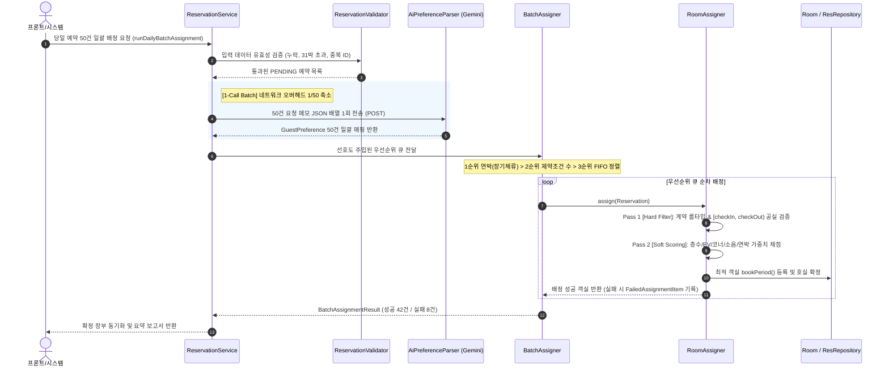
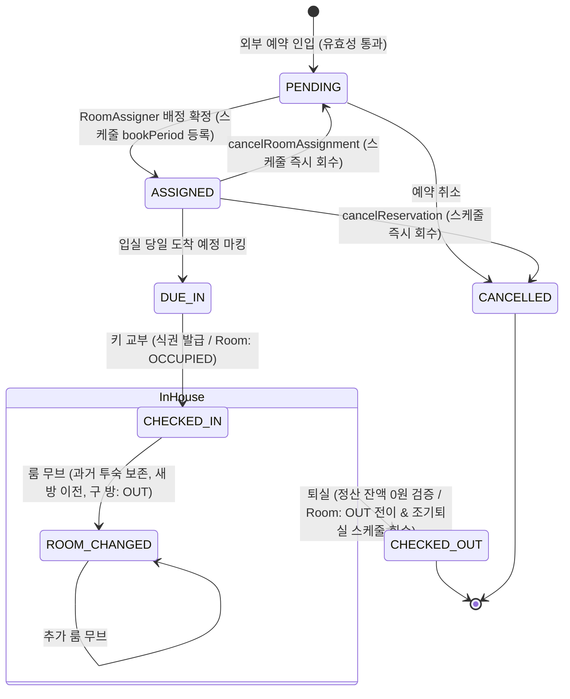

# 🏨 Hotel PMS Core & Room Auto-Assignment Engine

실제 비즈니스/시티 호텔의 층별 건축 도면 규격(191실)과 글로벌 PMS(Opera 표준) 도메인 라이프사이클을 정밀하게 모델링한 Java 21 기반 호텔 자산 관리 시스템 코어 엔진입니다[cite: 5].

---

## 1. 시스템 설계도 (System Architecture & Blueprints)

### ① 191실 층별 건축 구조 및 인벤토리 매핑
서구권 금기 번호(13호) 및 상층부 공조/설비실 결번을 완벽 반영한 물리 도면 설계도입니다[cite: 5].

```
[14F ~ 15F 상층부 특수층] (층당 13실 / 2개 층 = 총 26실)
┌────┬────┬────┬────┬────┬────┬────┬────┬────┬────┬────┬────┬────┬────┬────┬────┐
│ 01 │ 02 │ XX │ 04 │ 05 │ 06 │ XX │ 08 │ 09 │ 10 │ 11 │ 12 │ XX │ 14 │ 15 │ 16 │
└────┴────┴────┴────┴────┴────┴────┴────┴────┴────┴────┴────┴────┴────┴────┴────┘
 * 결번: 03호, 07호(설비실), 13호(금기) / 04, 08호: EXECUTIVE_DOUBLE

[03F ~ 13F 일반 객실층] (층당 15실 / 11개 층 = 총 165실)
┌────┬────┬────┬────┬────┬────┬────┬────┬────┬────┬────┬────┬────┬────┬────┬────┐
│ 01 │ 02 │ 03 │ 04 │ 05 │ 06 │ 07 │ 08 │ 09 │ 10 │ 11 │ 12 │ XX │ 14 │ 15 │ 16 │
└────┴────┴────┴────┴────┴────┴────┴────┴────┴────┴────┴────┴────┴────┴────┴────┘
 * 결번: 13호(금기) / 03, 04, 07, 08호: MODERATE_DOUBLE

[특성 구역 매핑]
- 코너룸 구역: 01호, 02호, 09호, 14호, 16호 (2면 창문, 소음 최소화)
- 엘리베이터 인접 구역: 03호 ~ 08호 (보행 약자 접근성 우수 / 소음 취약 구역)
```

---

### ② 2-Pass 파이프라인 & AI 배치 파싱 시퀀스 다이어그램
50건의 예약을 단 1회의 HTTP POST 호출로 Gemini API에 전달해 선호도를 추출하고, 2-Pass 알고리즘으로 안전하게 배정합니다[cite: 5].



---

### ③ 호텔 PMS 실무 라이프사이클 상태 전이도 (State Machine)
`Reservation`(예약 전산)과 `Room`(실물 룸 랙) 간의 상호작용 상태 머신입니다[cite: 5].



---

## 2. 핵심 기술적 의사결정 및 트러블슈팅 (Engineering Deep Dive)

### 1) 0박 당일 및 연박 도중 룸 체인지 시 스케줄 정합성 보장 (`truncatePeriodFrom`)
* **문제 상황**:
  3박 투숙객이 2일 차에 방을 이동하거나, 체크인 당일 입실 직후(0박 투숙) 방을 교체할 때 단순 `cancelPeriod`를 호출하면 **과거 투숙 이력이 증발**하거나 **새 방에 전체 기간이 중복 점유**되는 결함 발생[cite: 4, 5].
* **해결 방법**:
  `Room.truncatePeriodFrom(moveDate)`를 도입해 이동일자 경계를 엄밀히 분기 처리[cite: 4, 5]:
    * `moveDate == checkInDate` (0박 당일 이동): 과거 숙박이 없으므로 이전 방의 스케줄을 완전 회수[cite: 4, 5].
    * `checkInDate < moveDate < checkOutDate` (연박 도중 이동): 과거 구간(`[checkIn, moveDate)`)만 기존 방에 영구 보존하고, 신규 객실에는 잔여 구간(`[moveDate, checkOut)`)만 분할 등록[cite: 4, 5].
    * 예약 엔티티에 `previousRoomNumber`를 영구 기록하여 하우스키핑 및 정산 감사 추적(Audit Trail) 확보[cite: 5].

### 2) 조기 체크아웃(Early Departure) 시 유령 점유(Ghost Booking) 원천 차단
* **문제 상황**:
  3박 고객이 1박만 하고 조기 퇴실할 때 객실 상태만 `OUT`으로 바꾸면, 객실 스케줄(`bookedPeriods`)에는 여전히 남은 2박이 잠겨 있어 당일 밤 새 손님 배정을 가로막는 현상 발생[cite: 3, 5].
* **해결 방법**:
  `ReservationService.processCheckOut` 단계에서 `room.truncatePeriodFrom(LocalDate.now())`를 트리거하여 오늘 이후의 미래 스케줄을 즉시 반납, 객실을 오늘 밤 판매 가능한 인벤토리로 정상 환원[cite: 3, 5].

### 3) 룸 매트릭스 렌더링 시 하우스키핑 물리 상태 우선권 보정
* **문제 상황**:
  `FloorStatusService`에서 객실 상태를 그릴 때 스케줄 점유 검사(`isOccupiedOn`)를 먼저 타면, 손님이 퇴실하여 청소 대기 중인 `OUT` 방이나 고장 수리 중인 `BREAK` 방이 "투숙 중인 `OCCUPIED` 방"으로 왜곡되어 청소 지시 불가[cite: 2, 5].
* **해결 방법**:
  스케줄 유무보다 실제 하우스키핑/운영 룸 랙 상태(`OUT`, `CLEANING`, `BREAK`, `BLOCKED`)를 최우선 판정하도록 순서를 재설계하여 실무 룸 랙 화면의 무결성 확보[cite: 4, 5].

### 4) Gemini API 1-Call 배치 파싱으로 네트워크 오버헤드 최소화
* **설계 의도**: 50건의 예약을 개별 HTTP 통신(50회)으로 처리하지 않고, 단 1회의 HTTP POST 통신(JSON 배열 일괄 전송)으로 구조화[cite: 5].
* **성과**: 건당 통신 오버헤드를 없애고 API 응답 시간을 50건 기준 약 15초(건당 0.3초)로 단축, 분당 호출 수(RPM) 소모를 1회로 방어[cite: 5].

---

## 3. 핵심 도메인 규칙 요약 (Hospitality Rules)

| 규칙 항목 | 도메인 적용 내용 |
| :--- | :--- |
| **반개구간 회전율** | `[checkIn, checkOut)` 기준 관리로 9/22 퇴실과 9/22 입실 간 충돌 방지[cite: 5] |
| **정산 검증 방어** | 현장 결제 미납금 또는 미니바 부대비용 잔액이 존재할 시 체크아웃 차단 (`PaymentLedger`)[cite: 5] |
| **식권 자동 발급** | 조식 포함 플랜 고객 체크인 시 총 소요 식권 계산 및 발급 상태 자동 전이 (`BreakfastOption`)[cite: 5] |
| **연박 고객 우대** | 3박 이상 연박 투숙객에게 스코어 1.3배 가중치 및 코너/소음 차단 객실 우선 배정 (`RoomAssigner`)[cite: 5] |
| **재실 고객 검색** | `stayingDate` 필터를 통해 특정 일자에 실제로 투숙 중인 인하우스 고객 동적 검색 지원[cite: 5] |

---

## 4. 실행 및 검증 (Quick Start & Test)

### 환경 설정 (`.env`)
프로젝트 루트 경로에 `.env` 파일을 생성하고 Gemini API 키를 설정합니다[cite: 5].
```env
GEMINI_API_KEY=your_gemini_api_key_here
GEMINI_MODEL_NAME=gemini-2.5-flash
GEMINI_TEMPERATURE=0.1
GEMINI_THINKING_BUDGET=0
```

### 단위 테스트 실행 (39개 이상 테스트 전수 통과)
```bash
./gradlew test
```
* `ReservationDomainTest`: 채널 식별, 조식 식권 발급, 미정산 체크아웃 차단, 레이트아웃[cite: 5]
* `StayPeriodTest`: 반개구간 경계값, 체크아웃 당일 회전율 충돌 방지[cite: 5]
* `RoomRepositoryTest`: 191실 매핑, 13호 결번 및 14~15층 설비 결번 검증[cite: 5]
* `RoomAssignerTest` / `BatchAssignerTest`: 연박 가중치 우대, 만실 격리, 선호도 점수 검증[cite: 5]
* `RoomChangeServiceTest`: 0박 당일 이동, 잔여 박수 분할 및 과거 이력 보존, OUT 객실 차단[cite: 5]
* `ReservationServiceTest`: 당일 배치 배정, 조기 체크아웃 스케줄 단축, 취소 시 스케줄 반납[cite: 5]
* `ReservationRepositoryTest`: 복합 동적 검색 및 `stayingDate` 재실 고객 필터링[cite: 5]
* `FloorStatusServiceTest`: 하우스키핑 상태 우선권 보존 및 점유율(OCC) 산출 검증[cite: 5]