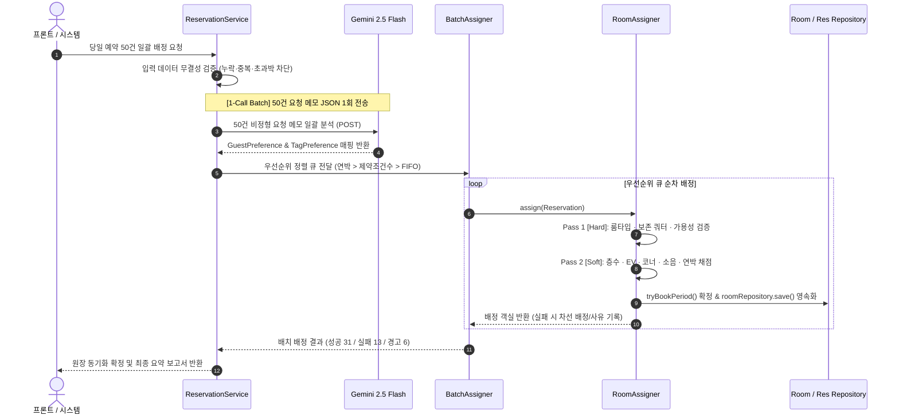
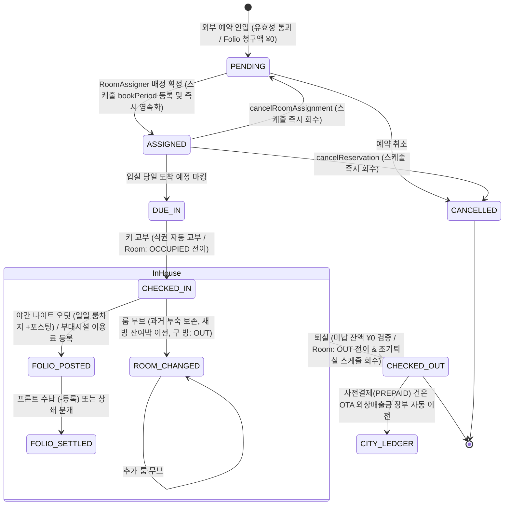

# Hotel PMS Core & Room Auto-Assignment Engine

실제 비즈니스/시티 호텔의 층별 건축 도면 규격(191실)과 글로벌 PMS(Opera 표준) 도메인 라이프사이클 및 불변 원장 감사 추적(Audit Trail)을 정밀하게 모델링한 Java 21 기반 호텔 자산 관리 시스템 코어 엔진입니다.

---

## 1. 시스템 설계도 (System Architecture & Blueprints)

### ① 191실 층별 건축 구조 및 인벤토리 매핑
서구권 금기 번호(13호) 및 상층부 공조/설비실 결번을 완벽 반영한 물리 도면 설계도입니다.

```
[14F ~ 15F 상층부 특수층] (층당 13실 / 2개 층 = 총 26실)
┌────┬────┬────┬────┬────┬────┬────┬────┬────┬────┬────┬────┬────┬────┬────┬────┐
│ 01 │ 02 │ XX │ 04 │ 05 │ 06 │ XX │ 08 │ 09 │ 10 │ 11 │ 12 │ XX │ 14 │ 15 │ 16 │
└────┴────┴────┴────┴────┴────┴────┴────┴────┴────┴────┴────┴────┴────┴────┴────┘
 * 결번: 03호, 07호(설비실), 13호(금기) / 04, 08호: EXECUTIVE_DOUBLE (호텔 전체 총 4실 한정 인벤토리)

[03F ~ 13F 일반 객실층] (층당 15실 / 11개 층 = 총 165실)
┌────┬────┬────┬────┬────┬────┬────┬────┬────┬────┬────┬────┬────┬────┬────┬────┐
│ 01 │ 02 │ 03 │ 04 │ 05 │ 06 │ 07 │ 08 │ 09 │ 10 │ 11 │ 12 │ XX │ 14 │ 15 │ 16 │
└────┴────┴────┴────┴────┴────┴────┴────┴────┴────┴────┴────┴────┴────┴────┴────┘
 * 결번: 13호(금기) / 03, 04, 07, 08호: MODERATE_DOUBLE

[특성 구역 매핑]
- 코너룸 구역: 01호, 02호, 09호, 14호, 16호 (2면 창문, 소음 최소화)
- 엘리베이터 인접 구역: 03호 ~ 08호 (보행 약자 접근성 우수 / 소음 취약 구역)
```

---

### ② 2-Pass 파이프라인 & AI 배치 파싱 시퀀스 다이어그램
50건의 예약을 단 1회의 HTTP POST 호출로 Gemini API에 전달해 선호도를 추출하고, 2-Pass 알고리즘과 실시간 저장소 영속화로 안전하게 분산 배정합니다.


```mermaid
sequenceDiagram
  autonumber
  actor Staff as 프론트 / 시스템
  participant RS as ReservationService
  participant AI as Gemini 2.5 Flash
  participant BA as BatchAssigner
  participant RA as RoomAssigner
  participant DB as Room / Res Repository

  Staff->>RS: 당일 예약 50건 일괄 배정 요청
  RS->>RS: 입력 데이터 무결성 검증 (누락·중복·초과박 차단)

  Note over RS,AI: [1-Call Batch] 50건 요청 메모 JSON 1회 전송
  RS->>AI: 50건 비정형 요청 메모 일괄 분석 (POST)
  AI-->>RS: GuestPreference & TagPreference 매핑 반환

  RS->>BA: 우선순위 정렬 큐 전달 (연박 > 제약조건수 > FIFO)

  loop 우선순위 큐 순차 배정
    BA->>RA: assign(Reservation)
    RA->>RA: Pass 1 [Hard]: 룸타입 · 보존 쿼터 · 가용성 검증
    RA->>RA: Pass 2 [Soft]: 층수 · EV · 코너 · 소음 · 연박 채점
    RA->>DB: tryBookPeriod() 확정 & roomRepository.save() 영속화
    RA-->>BA: 배정 객실 반환 (실패 시 차선 배정/사유 기록)
  end

  BA-->>RS: 배치 배정 결과 (성공 31 / 실패 13 / 경고 6)
  RS-->>Staff: 원장 동기화 확정 및 최종 요약 보고서 반환
```

---

### ③ 호텔 PMS 실무 라이프사이클 및 회계 원장 상태 전이도 (State Machine)
`Reservation`(예약 전산), `Room`(실물 룸 랙), `PaymentLedger`(Folio 원장) 간의 상호작용 상태 머신입니다.


```mermaid
stateDiagram-v2
    [*] --> PENDING: 외부 예약 인입 (유효성 통과 / Folio 청구액 ¥0)
    PENDING --> ASSIGNED: RoomAssigner 배정 확정 (스케줄 bookPeriod 등록 및 즉시 영속화)
    ASSIGNED --> DUE_IN: 입실 당일 도착 예정 마킹
    ASSIGNED --> PENDING: cancelRoomAssignment (스케줄 즉시 회수)
    
    DUE_IN --> CHECKED_IN: 키 교부 (식권 자동 교부 / Room: OCCUPIED 전이)
    
    state InHouse {
        CHECKED_IN --> ROOM_CHANGED: 룸 무브 (과거 투숙 보존, 새 방 잔여박 이전, 구 방: OUT)
        ROOM_CHANGED --> ROOM_CHANGED: 추가 룸 무브
        CHECKED_IN --> FOLIO_POSTED: 야간 나이트 오딧 (일일 룸차지 +포스팅) / 부대시설 이용료 등록
        FOLIO_POSTED --> FOLIO_SETTLED: 프론트 수납 (-등록) 또는 상쇄 분개
    }
    
    InHouse --> CHECKED_OUT: 퇴실 (미납 잔액 ¥0 검증 / Room: OUT 전이 & 조기퇴실 스케줄 회수)
    CHECKED_OUT --> CITY_LEDGER: 사전결제(PREPAID) 건은 OTA 외상매출금 장부 자동 이전
    CHECKED_OUT --> [*]
    
    PENDING --> CANCELLED: 예약 취소
    ASSIGNED --> CANCELLED: cancelReservation (스케줄 즉시 회수)
    CANCELLED --> [*]
```

---

## 2. 핵심 기술적 의사결정 및 트러블슈팅 (Engineering Deep Dive)

### 1) 일괄 자동 배정 시 동일 객실 중복 배정(Over-assignment) 방어
* **문제 상황**:
  배치 배정 과정에서 메모리 상의 `candidate.tryBookPeriod()`만 호출하고 데이터베이스에 즉시 반영하지 않으면, 다음 루프의 예약이 `roomRepository.findAll()`을 호출할 때 해당 객실이 여전히 공실로 조회되어 **동일한 1순위 방에 모든 예약이 겹쳐서 배정되는 결함** 발생.
* **해결 방법**:
  `RoomAssigner.assign` 단계에서 객실 선점 직후 `roomRepository.save(candidate)`를 즉각 호출하여 `room_schedules` 테이블에 스케줄을 실시간 영속화함으로써 이후 예약 건들의 가용성 판정 충돌을 완벽 차단.

### 2) 엄격한 호텔 회계 기준 Folio 불변 원장(Audit Trail) 구현
* **문제 상황**:
  예약 생성 시점에 미래 숙박료를 강제로 사전 청구(+¥60,000)하거나 거래 총액만 DB 컬럼(`total_charges`, `total_payments`)에 덮어쓸 경우, 거래가 1건으로 뭉개지거나 아직 투숙하지 않은 예약에 미납금이 발생하는 결함 발생.
* **해결 방법**:
  * **0원 베이스 원장 원칙**: 체크인 전/나이트 오딧 전에는 청구 잔액을 정직하게 **¥0**으로 유지.
  * **순차적 나이트 오딧 포스팅**: 실제 투숙 중인(`CHECKED_IN`) 고객에게만 야간 마감 시점에 그날의 1박 요금(`ROOM_CHARGE`)을 1행씩 차례대로 누적 포스팅.
  * **전표 개별 영속화**: `FolioTransaction` VO에 Jackson 기본 생성자 및 `JavaTimeModule`을 탑재하여 `transactions_json` `@Lob` 컬럼에 각 거래(식별번호, 과목, 금액, 일시)를 개별 행으로 안전하게 보존·복원.

### 3) 0박 당일 및 연박 도중 룸 체인지 시 스케줄 정합성 보장 (`truncatePeriodFrom`)
* **문제 상황**:
  3박 투숙객이 2일 차에 방을 이동하거나 체크인 당일 입실 직후(0박 투숙) 방을 교체할 때 단순 `cancelPeriod`를 호출하면 **과거 투숙 이력이 증발**하거나 **새 방에 전체 기간이 중복 점유**되는 결함 발생.
* **해결 방법**:
  `Room.truncatePeriodFrom(moveDate)`를 도입해 이동일자 경계를 엄밀히 분기 처리:
  * `moveDate == checkInDate` (0박 당일 이동): 과거 숙박이 없으므로 이전 방의 스케줄을 완전 회수.
  * `checkInDate < moveDate < checkOutDate` (연박 도중 이동): 과거 구간(`[checkIn, moveDate)`)만 기존 방에 영구 보존하고, 신규 객실에는 잔여 구간(`[moveDate, checkOut)`)만 분할 등록.
  * 예약 엔티티에 `previousRoomNumber`를 영구 기록하여 하우스키핑 및 정산 감사 추적 확보.

### 4) 조기 체크아웃(Early Departure) 시 유령 점유(Ghost Booking) 원천 차단
* **문제 상황**:
  3박 고객이 1박만 하고 조기 퇴실할 때 객실 상태만 `OUT`으로 바꾸면, 객실 스케줄(`bookedPeriods`)에는 여전히 남은 2박이 잠겨 있어 당일 밤 새 손님 배정을 가로막는 현상 발생.
* **해결 방법**:
  `ReservationService.processCheckOut` 단계에서 `room.truncatePeriodFrom(LocalDate.now())`를 트리거하여 오늘 이후의 미래 스케줄을 즉시 반납, 객실을 오늘 밤 판매 가능한 인벤토리로 정상 환원.

### 5) 룸 매트릭스 렌더링 시 하우스키핑 물리 상태 우선권 보정
* **문제 상황**:
  `FloorStatusService`에서 객실 상태를 그릴 때 스케줄 점유 검사(`isOccupiedOn`)를 먼저 타면, 손님이 퇴실하여 청소 대기 중인 `OUT` 방이나 고장 수리 중인 `BREAK` 방이 "투숙 중인 `OCCUPIED` 방"으로 왜곡되어 청소 지시 불가.
* **해결 방법**:
  스케줄 유무보다 실제 하우스키핑/운영 룸 랙 상태(`OUT`, `CLEANING`, `BREAK`, `BLOCKED`)를 최우선 판정하도록 순서를 재설계하여 실무 룸 랙 화면의 무결성 확보.

### 6) 미도착 예약 노쇼 방어 및 익일 롤오버 (0박 보존 정책)
* **문제 상황**:
  당일 밤 12시까지 고객이 도착하지 않았다고 해서 1박 단박 예약을 무조건 취소 처리하면, 새벽 비행기로 늦게 도착하는 고객의 방이 강제로 증발하는 문제 발생.
* **해결 방법**:
  나이트 오딧 실행 전 `rolloverUncheckedArrivals` 파이프라인을 가동하여 1박 단박 미체크인 건을 즉시 취소하지 않고 **'0박 (새벽 도착 당일 퇴실)'** 상태로 1박을 차감하여 익일로 안전하게 이월 보존.

### 7) OTA 후불 청구 외상매출금(City Ledger) 자동 분개
* **설계 의도**: 사전 결제(PREPAID) 고객이 프론트에서 추가 결제 없이 체크아웃할 때, 정산 대금을 버리지 않고 아고다/부킹닷컴 등 원천 OTA 채널별 후불 청구 장부로 자동 이체.
* **성과**: `CityLedgerRecordEntity`를 통해 채널별 정산 총액 및 미수금 청구 명세서를 실시간으로 집계 및 회계 대조 가능.

### 8) Gemini API 1-Call 배치 파싱으로 네트워크 오버헤드 최소화
* **설계 의도**: 50건의 예약을 개별 HTTP 통신(50회)으로 처리하지 않고, 단 1회의 HTTP POST 통신(JSON 배열 일괄 전송)으로 구조화.
* **성과**: 건당 통신 오버헤드를 없애고 API 응답 시간을 50건 기준 약 15초(건당 0.3초)로 단축, 분당 호출 수(RPM) 소모를 1회로 방어.

---

## 3. 핵심 도메인 규칙 요약 (Hospitality Rules)

| 규칙 항목 | 도메인 적용 내용 |
| :--- | :--- |
| **반개구간 회전율** | `[checkIn, checkOut)` 기준 관리로 9/22 퇴실과 9/22 입실 간 충돌 방지 |
| **Zero-Balance 체크아웃** | 현장 결제 미납금 또는 미니바 부대비용 잔액이 1원이라도 존재할 시 체크아웃 차단 (`PaymentLedger`) |
| **식권 자동 발급** | 조식 포함 플랜 고객 체크인 시 총 소요 식권 계산 및 발급 상태 자동 전이 (`BreakfastOption`) |
| **연박 고객 우대** | 3박 이상 연박 투숙객에게 스코어 1.3배 가중치 및 코너/소음 차단 객실 우선 배정 (`RoomAssigner`) |
| **재실 고객 검색** | `stayingDate` 필터를 통해 특정 일자에 실제로 투숙 중인 인하우스 고객 동적 검색 지원 |
| **안전 보존 쿼터 (Hold)** | 상층부 이그제큐티브(총 4실 한정) 등 특정 타입 및 특수 태그의 일반 배정 과점 방어 (`QuotaPolicy`) |

---

## 4. 실행 및 검증 (Quick Start & Test)

### 환경 설정 (`.env`)
프로젝트 루트 경로에 `.env` 파일을 생성하고 Gemini API 키를 설정합니다.
```env
GEMINI_API_KEY=your_gemini_api_key_here
GEMINI_MODEL_NAME=gemini-2.5-flash
GEMINI_TEMPERATURE=0.1
GEMINI_THINKING_BUDGET=0
```

### 단위 및 통합 테스트 실행
```bash
./gradlew test
```
* `ReservationDomainTest`: 채널 식별, 조식 식권 발급, 미정산 체크아웃 차단, 0원 베이스 결제 원장 잔액 계산
* `StayPeriodTest`: 반개구간 경계값, 체크아웃 당일 회전율 충돌 방지
* `RoomRepositoryTest`: 191실 매핑, 13호 결번 및 14~15층 설비 결번 검증
* `RoomAssignerTest` / `BatchAssignerTest`: 연박 가중치 우대, 만실 격리, 선호도 점수 검증, 선점 시 실시간 영속화 검증
* `RoomChangeServiceTest`: 0박 당일 이동, 잔여 박수 분할 및 과거 이력 보존, OUT 객실 차단
* `ReservationServiceTest`: 당일 배치 배정, 조기 체크아웃 스케줄 단축, 취소 시 스케줄 반납, Folio 전표 분개 검증
* `ReportExportServiceTest`: 복합 동적 검색, 출발 예정자 미수금 산출, 하우스키핑 청소 지시서 개인정보 마스킹 검증
* `NightAuditServiceTest`: 미도착 예약 0박 이월 롤오버, 재실 룸차지 1박 포스팅 및 영업일자 전진 검증