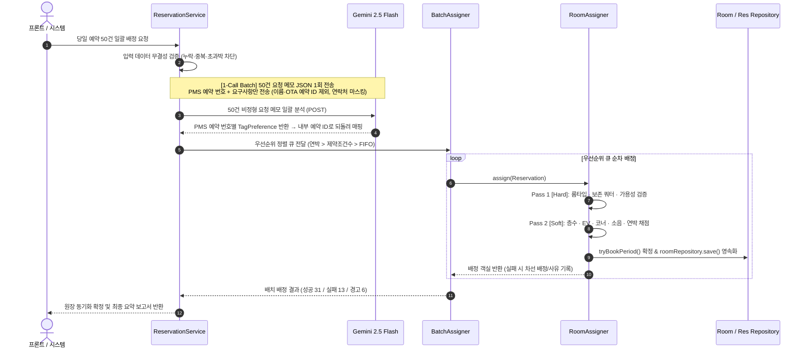
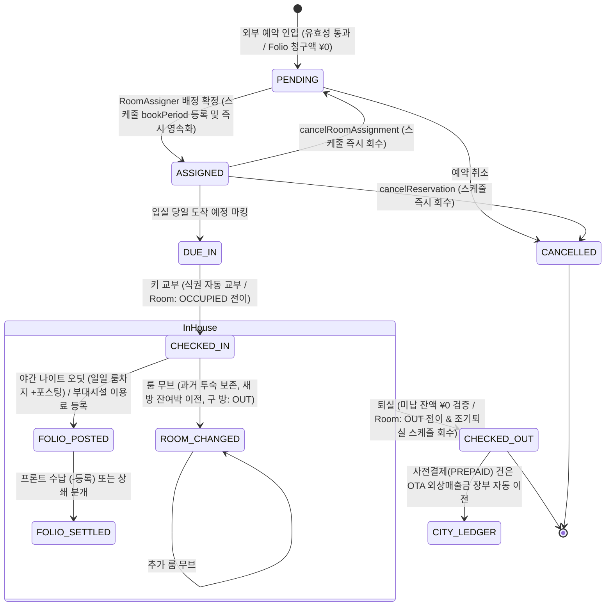

# Hotel PMS Core & Room Auto-Assignment Engine

[](https://github.com/Achan-one/hotel-pms-ai/actions/workflows/ci.yml)


191실 규모 호텔의 **프론트 데스크 운영을 위한 PMS(Property Management System) 백엔드**입니다.
예약 인입부터 객실 배정, 룸체인지, 체크인·아웃, 폴리오(회계 원장), 나이트 오딧, OTA 정산, CSV 리포트까지 실무 라이프사이클을 다루고,
투숙객이 자유 문장으로 적은 요청("어머니 무릎이 안 좋으셔서 엘리베이터 가까운 낮은 층")을 **AI가 객실 태그로 바꾸고, 규칙 기반 점수 알고리즘이 방을 배정**합니다.

> 프론트엔드: [hotel-pms-web](https://github.com/Achan-one/hotel-pms-web) (React + TypeScript)

## 이 프로젝트의 핵심

| | |
|---|---|
| **AI는 배정하지 않는다** | LLM은 "메모 → 태그 변환"만 맡고, 배정은 결정적인 점수 알고리즘이 한다. AI가 실패해도 알고리즘만으로 배정은 계속된다. |
| **동시성** | 객실은 비관적 락, 예약은 낙관적 락, 일괄 배정 중에는 서버가 예약 변경을 `423`으로 막는다. 실제 MySQL로 검증한다. |
| **개인정보 최소화** | 외부 AI에는 PMS 예약 번호와 요구사항만 보낸다. 이름과 OTA 예약 ID는 나가지 않는다. |
| **회계 정합성** | 불변 원장(Folio), 0원 베이스 청구, 나이트 오딧 멱등성, 미정산 체크아웃 차단 |
| **검증 가능성** | 테스트 318건(실제 MySQL 통합 테스트 포함) + AI 정확도 평가 하네스 |

## 목차
1. [주요 기능](#주요-기능) · [기술 스택](#기술-스택) · [프로젝트 구조](#프로젝트-구조)
2. [시스템 설계도](#1-시스템-설계도-system-architecture--blueprints)
3. [핵심 기술적 의사결정](#2-핵심-기술적-의사결정-및-트러블슈팅-engineering-deep-dive)
4. [도메인 규칙](#3-핵심-도메인-규칙-요약-hospitality-rules)
5. [API 개요와 권한](#api-개요와-권한) · [AI 태그 추출 정확도](#ai-태그-추출-정확도-평가)
6. [실행 및 검증](#4-실행-및-검증-quick-start--test) · [알려진 한계](#알려진-한계) · [로드맵](#로드맵)

## 주요 기능

* **룸 랙(룸 매트릭스)**: 층별 191실의 상태(공실/배정/재실/청소대기/점검)를 한 화면에서 확인. 칸에 마우스를 올리면 고객명과 보유 태그가 보인다.
* **일괄 자동 배정 / 일괄 해제**: 체크인 일자를 골라 미배정 예약을 한 번에 배정하고, 배정 완료 예약을 한 번에 해제한다. 진행 중에는 모든 직원의 예약 화면이 읽기 전용이 된다.
* **AI 태그 분석**: 한국어·일본어·영어 요청 메모에서 선호/기피 태그를 추출(1회 일괄 호출).
* **태그 사전 관리**: 기본 태그 7개 + 관리자가 정의하는 커스텀 태그, 객실별 태그 매핑, 태그별 보유 객실을 도면에서 확인하는 객실 매트릭스.
* **예약 관리**: PMS 예약 번호 / OTA 예약번호 / 예약 ID 통합 검색, 페이징, 수동 배정·배정 취소·룸체인지, 낙관적 락 충돌 감지.
* **폴리오(원장)**: 이용 명세(+)와 수납(-)을 거래 단위로 누적, 동시 상쇄 분개, 미정산 체크아웃 차단.
* **나이트 오딧**: 미도착 예약 0박 이월/노쇼 처리, 재실 객실료 포스팅, 영업일 전진(멱등).
* **OTA 정산(City Ledger)**: 사전결제 예약의 체크아웃 시 채널별 외상매출금 자동 분개.
* **CSV 리포트**: 숙박자 리스트(기간), 예약자 리스트(기간·전체 정보), 태그·요청사항, 룸 태그 인벤토리, 배정 점수 내역(관리자 전용).
* **직원 계정과 권한**: 관리자 / 정직원 / 아르바이트 3단계, 계정 활성화·비활성화, 로그인 잠금.

## 기술 스택

| 영역 | 사용 기술 |
|---|---|
| 백엔드 | Java 21, Spring Boot 3.3, Spring Security(JWT, jjwt), Spring Data JPA(Hibernate), Bean Validation |
| DB | MySQL 8.4, Flyway 마이그레이션 7개(`db/migration`) |
| AI | Google Gemini 2.5 Flash (REST, JSON 응답 모드) |
| 테스트 | JUnit 5, Spring Boot Test, MockMvc, Testcontainers(MySQL), H2 |
| 빌드/CI | Gradle, GitHub Actions |
| 프론트엔드 | React 19, TypeScript, Vite, Tailwind CSS 4, axios (별도 저장소) |

## 프로젝트 구조

```
src/main/java/com/hotel
├─ api/          REST 컨트롤러, 요청·응답 DTO, 전역 예외 처리
├─ service/      예약·배정·나이트 오딧·태그 서비스, 점수 엔진, 일괄 작업 잠금, AI 파서
│  └─ report/    CSV 리포트 서비스와 직렬화
├─ domain/       Reservation, Room, PaymentLedger 등 순수 도메인 모델 (프레임워크 비의존)
├─ entity/       JPA 엔티티 (도메인 ↔ 엔티티 변환 포함)
├─ repository/   저장소 인터페이스 + JPA 구현(rdb) + 인메모리 구현(memory, 단위 테스트용)
├─ security/     JWT 필터, 보안 설정(역할별 인가)
├─ channel/      OTA 어댑터(TLX, ONDA) — 개발/시뮬레이션용
└─ config/       빈 설정, 웹 MVC 인터셉터
src/main/resources/db/migration   Flyway 마이그레이션 V1 ~ V7
src/test                          단위·통합·보안·동시성 테스트, AI 평가 하네스(aieval)
```

---

## 1. 시스템 설계도 (System Architecture & Blueprints)

### ① 191실 층별 건축 구조 및 인벤토리 매핑
서구권 금기 번호(13호) 및 상층부 공조/설비실 결번을 반영한 물리 도면 설계도입니다.

```
[14F ~ 15F 상층부 특수층] (층당 13실 / 2개 층 = 총 26실)
┌────┬────┬────┬────┬────┬────┬────┬────┬────┬────┬────┬────┬────┬────┬────┬────┐
│ 01 │ 02 │ XX │ 04 │ 05 │ 06 │ XX │ 08 │ 09 │ 10 │ 11 │ 12 │ XX │ 14 │ 15 │ 16 │
└────┴────┴────┴────┴────┴────┴────┴────┴────┴────┴────┴────┴────┴────┴────┴────┘
 * 결번: 03호, 07호(설비실), 13호(금기) / 04, 08호: EXECUTIVE_DOUBLE (호텔 전체 총 4실 한정 인벤토리)

[03F ~ 13F 일반 객실층] (층당 15실 / 11개 층 = 총 165실)
┌────┬────┬────┬────┬────┬────┬────┬────┬────┬────┬────┬────┬────┬────┬────┬────┐
│ 01 │ 02 │ 03 │ 04 │ 05 │ 06 │ 07 │ 08 │ 09 │ 10 │ 11 │ 12 │ XX │ 14 │ 15 │ 16 │
└────┴────┴────┴────┴────┴────┴────┴────┴────┴────┴────┴────┴────┴────┴────┴────┘
 * 결번: 13호(금기) / 03, 04, 07, 08호: MODERATE_DOUBLE

[특성 구역 매핑]
- 코너룸 구역: 01호, 02호, 09호, 14호, 16호 (2면 창문, 소음 최소화)
- 엘리베이터 인접 구역: 03호 ~ 08호 (보행 약자 접근성 우수 / 소음 취약 구역)
```

---

### ② 2-Pass 파이프라인 & AI 배치 파싱 시퀀스 다이어그램
50건의 예약 요구사항을 단 1회의 HTTP POST 호출로 Gemini API에 전달해 태그 선호도를 추출하고, 2-Pass 알고리즘과 실시간 저장소 영속화로 안전하게 분산 배정합니다.


```mermaid
sequenceDiagram
  autonumber
  actor Staff as 프론트 / 시스템
  participant RS as ReservationService
  participant AI as Gemini 2.5 Flash
  participant BA as BatchAssigner
  participant RA as RoomAssigner
  participant DB as Room / Res Repository

  Staff->>RS: 당일 예약 50건 일괄 배정 요청
  RS->>RS: 입력 데이터 무결성 검증 (누락·중복·초과박 차단)

  Note over RS,AI: [1-Call Batch] 50건 요청 메모 JSON 1회 전송<br/>PMS 예약 번호 + 요구사항만 전송 (이름·OTA 예약 ID 제외, 연락처 마스킹)
  RS->>AI: 50건 비정형 요청 메모 일괄 분석 (POST)
  AI-->>RS: PMS 예약 번호별 TagPreference 반환 → 내부 예약 ID로 되돌려 매핑

  RS->>BA: 우선순위 정렬 큐 전달 (연박 > 제약조건수 > FIFO)

  loop 우선순위 큐 순차 배정
    BA->>RA: assign(Reservation)
    RA->>RA: Pass 1 [Hard]: 룸타입 · 보존 쿼터 · 가용성 검증
    RA->>RA: Pass 2 [Soft]: 층수 · EV · 코너 · 소음 · 연박 채점
    RA->>DB: tryBookPeriod() 확정 & roomRepository.save() 영속화
    RA-->>BA: 배정 객실 반환 (실패 시 차선 배정/사유 기록)
  end

  BA-->>RS: 배치 배정 결과 (성공 31 / 실패 13 / 경고 6)
  RS-->>Staff: 원장 동기화 확정 및 최종 요약 보고서 반환
```

---

### ③ 호텔 PMS 실무 라이프사이클 및 회계 원장 상태 전이도 (State Machine)
`Reservation`(예약 전산), `Room`(실물 룸 랙), `PaymentLedger`(Folio 원장) 간의 상호작용 상태 머신입니다.


```mermaid
stateDiagram-v2
    [*] --> PENDING: 외부 예약 인입 (유효성 통과 / Folio 청구액 ¥0)
    PENDING --> ASSIGNED: RoomAssigner 배정 확정 (스케줄 bookPeriod 등록 및 즉시 영속화)
    ASSIGNED --> DUE_IN: 입실 당일 도착 예정 마킹
    ASSIGNED --> PENDING: cancelRoomAssignment (스케줄 즉시 회수)
    
    DUE_IN --> CHECKED_IN: 키 교부 (식권 자동 교부 / Room: OCCUPIED 전이)
    
    state InHouse {
        CHECKED_IN --> ROOM_CHANGED: 룸 무브 (과거 투숙 보존, 새 방 잔여박 이전, 구 방: OUT)
        ROOM_CHANGED --> ROOM_CHANGED: 추가 룸 무브
        CHECKED_IN --> FOLIO_POSTED: 야간 나이트 오딧 (일일 룸차지 +포스팅) / 부대시설 이용료 등록
        FOLIO_POSTED --> FOLIO_SETTLED: 프론트 수납 (-등록) 또는 상쇄 분개
    }
    
    InHouse --> CHECKED_OUT: 퇴실 (미납 잔액 ¥0 검증 / Room: OUT 전이 & 조기퇴실 스케줄 회수)
    CHECKED_OUT --> CITY_LEDGER: 사전결제(PREPAID) 건은 OTA 외상매출금 장부 자동 이전
    CHECKED_OUT --> [*]
    
    PENDING --> CANCELLED: 예약 취소
    ASSIGNED --> CANCELLED: cancelReservation (스케줄 즉시 회수)
    CANCELLED --> [*]
```

---

## 2. 핵심 기술적 의사결정 및 트러블슈팅 (Engineering Deep Dive)

### 1) 일괄 자동 배정 시 동일 객실 중복 배정(Over-assignment) 방어
* **문제 상황**:
  배치 배정 과정에서 메모리 상의 `candidate.tryBookPeriod()`만 호출하고 데이터베이스에 즉시 반영하지 않으면, 다음 루프의 예약이 `roomRepository.findAll()`을 호출할 때 해당 객실이 여전히 공실로 조회되어 **동일한 1순위 방에 모든 예약이 겹쳐서 배정되는 결함** 발생.
* **해결 방법**:
  `RoomAssigner.assign` 단계에서 객실 선점 직후 `roomRepository.save(candidate)`를 즉각 호출하여 `room_schedules` 테이블에 스케줄을 실시간 영속화함으로써 이후 예약 건들의 가용성 판정 충돌을 차단.

### 2) 호텔 회계 기준 Folio 불변 원장 구현
* **문제 상황**:
  예약 생성 시점에 미래 숙박료를 강제로 사전 청구(+¥60,000)하거나 거래 총액만 DB 컬럼(`total_charges`, `total_payments`)에 덮어쓸 경우, 거래가 1건으로 뭉개지거나 아직 투숙하지 않은 예약에 미납금이 발생하는 결함 발생.
* **해결 방법**:
  * **0원 베이스 원장 원칙**: 체크인 전/나이트 오딧 전에는 청구 잔액을 정직하게 **¥0**으로 유지.
  * **순차적 나이트 오딧 포스팅**: 실제 투숙 중인(`CHECKED_IN`) 고객에게만 야간 마감 시점에 그날의 1박 요금(`ROOM_CHARGE`)을 1행씩 차례대로 누적 포스팅.
  * **전표 개별 영속화**: `FolioTransaction` VO에 Jackson 기본 생성자 및 `JavaTimeModule`을 탑재하여 `transactions_json` `@Lob` 컬럼에 각 거래(식별번호, 과목, 금액, 일시)를 개별 행으로 안전하게 보존·복원.

### 3) 0박 당일 및 연박 도중 룸 체인지 시 스케줄 정합성 보장 (`truncatePeriodFrom`)
* **문제 상황**:
  3박 투숙객이 2일 차에 방을 이동하거나 체크인 당일 입실 직후(0박 투숙) 방을 교체할 때 단순 `cancelPeriod`를 호출하면 **과거 투숙 이력이 증발**하거나 **새 방에 전체 기간이 중복 점유**되는 결함 발생.
* **해결 방법**:
  `Room.truncatePeriodFrom(moveDate)`를 도입해 이동일자 경계를 엄밀히 분기 처리:
  * `moveDate == checkInDate` (0박 당일 이동): 과거 숙박이 없으므로 이전 방의 스케줄을 완전 회수.
  * `checkInDate < moveDate < checkOutDate` (연박 도중 이동): 과거 구간(`[checkIn, moveDate)`)만 기존 방에 영구 보존하고, 신규 객실에는 잔여 구간(`[moveDate, checkOut)`)만 분할 등록.
  * 예약 엔티티에 `previousRoomNumber`를 영구 기록하여 하우스키핑 및 정산 감사 추적 확보.

### 4) 조기 체크아웃(Early Departure) 시 유령 점유(Ghost Booking) 원천 차단
* **문제 상황**:
  3박 고객이 1박만 하고 조기 퇴실할 때 객실 상태만 `OUT`으로 바꾸면, 객실 스케줄(`bookedPeriods`)에는 여전히 남은 2박이 잠겨 있어 당일 밤 새 손님 배정을 가로막는 현상 발생.
* **해결 방법**:
  `ReservationService.processCheckOut` 단계에서 `room.truncatePeriodFrom(실제 퇴실일)`를 트리거하여 오늘 이후의 미래 스케줄을 즉시 반납, 객실을 오늘 밤 판매 가능한 인벤토리로 정상 환원.

### 5) 룸 매트릭스 렌더링 시 하우스키핑 물리 상태 우선권 보정
* **문제 상황**:
  `FloorStatusService`에서 객실 상태를 그릴 때 스케줄 점유 검사(`isOccupiedOn`)를 먼저 타면, 손님이 퇴실하여 청소 대기 중인 `OUT` 방이나 고장 수리 중인 `BREAK` 방이 "투숙 중인 `OCCUPIED` 방"으로 왜곡되어 청소 지시 불가.
* **해결 방법**:
  스케줄 유무보다 실제 하우스키핑/운영 룸 랙 상태(`OUT`, `CLEANING`, `BREAK`, `BLOCKED`)를 최우선 판정하도록 순서를 재설계하여 실무 룸 랙 화면의 무결성 확보.

### 6) 미도착 예약 노쇼 방어 및 익일 롤오버 (0박 보존 정책)
* **문제 상황**:
  당일 밤 12시까지 고객이 도착하지 않았다고 해서 1박 단박 예약을 무조건 취소 처리하면, 새벽 비행기로 늦게 도착하는 고객의 방이 강제로 증발하는 문제 발생.
* **해결 방법**:
  나이트 오딧 실행 전 `rolloverUncheckedArrivals` 파이프라인을 가동하여 1박 단박 미체크인 건을 즉시 취소하지 않고 **'0박 (새벽 도착 당일 퇴실)'** 상태로 1박을 차감하여 익일로 안전하게 이월 보존.

### 7) OTA 후불 청구 외상매출금(City Ledger) 자동 분개
* **설계 의도**: 사전 결제(PREPAID) 고객이 프론트에서 추가 결제 없이 체크아웃할 때, 정산 대금을 버리지 않고 아고다/부킹닷컴 등 원천 OTA 채널별 후불 청구 장부로 자동 이체.
* **성과**: `CityLedgerRecordEntity`를 통해 채널별 정산 총액 및 미수금 청구 명세서를 실시간으로 집계 및 회계 대조 가능.

### 8) Gemini API 1-Call 배치 파싱으로 네트워크 오버헤드 최소화
* **설계 의도**: 50건의 예약을 개별 HTTP 통신(50회)으로 처리하지 않고, 단 1회의 HTTP POST 통신(JSON 배열 일괄 전송)으로 구조화.
* **성과**: 건당 통신 오버헤드를 없애고 API 응답 시간을 50건 기준 약 15초(건당 0.3초)로 단축, 분당 호출 수(RPM) 소모를 1회로 방어.

### 9) 객실은 비관적 락, 예약은 낙관적 락 (이중 락 전략)
* **문제 상황**: 같은 방을 두 직원이 동시에 배정하거나, 같은 예약을 두 명이 동시에 수정하면 나중 저장이 앞선 변경을 조용히 덮어쓴다.
* **해결 방법**:
  * **객실**: 배정, 룸체인지, 체크인 때 `SELECT ... FOR UPDATE`(`PESSIMISTIC_WRITE`)로 방 행을 잠가 이중 예약을 막는다. 두 방을 잠그는 룸체인지는 방 번호 순으로 잠가 교착을 피한다. 최종 방어선으로 `room_night_occupancy`의 (객실, 날짜) 기본키가 같은 날 이중 점유를 DB가 직접 거부한다.
  * **예약**: `@Version` 낙관적 락. 오래된 버전으로 저장하면 `409`를 돌려준다. 복제 메서드(`withTagPreference`)가 버전을 빠뜨리면 이 보호가 우회되므로 테스트로 고정했다.
* **검증**: 실제 MySQL 8.4(Testcontainers)에서 동시 배정, 동시 룸체인지, 관리자 동시 비활성화를 재현하는 통합 테스트.

### 10) 일괄 배정/해제 중 예약 편집 잠금 (서버 강제)
* **문제 상황**: AI 태그 분석과 일괄 배정이 도는 동안 다른 직원이 같은 예약을 수동 배정하거나 룸체인지를 하면 결과가 뒤엉킨다. 화면에서 버튼만 막으면 우회할 수 있다.
* **해결 방법**: `BatchOperationGuard`가 일괄 작업 동안만 전역 잠금을 잡고, `BatchLockInterceptor`가 조회가 아닌 예약 변경 요청을 `423 Locked`로 거절한다. 프론트는 진행 상태를 주기적으로 확인해 예약 상세를 기존 미리보기(읽기 전용) 모드로 전환한다.
  * 잠금은 **트랜잭션이 커밋된 뒤에** 풀린다(컨트롤러에서 감싸서 서비스의 `@Transactional`이 먼저 끝나게 함).
  * 작업이 예외로 끝나도 반드시 풀리고, 비정상 종료에 대비해 10분 뒤 자동 만료된다.
  * 테스트 데이터 생성과 시뮬레이션 API도 같은 잠금 대상이다.
* **한계**: 메모리 잠금이라 서버 1대 기준이다 (아래 "알려진 한계").

### 11) 외부 AI에 개인정보를 보내지 않기
* **문제 상황**: 투숙객 요청 메모를 외부 LLM API로 보내는 구조라, 이름이나 OTA 예약 ID 같은 식별 정보가 함께 나갈 수 있다.
* **해결 방법**:
  * PMS가 예약마다 직접 발급하는 **PMS 예약 번호**(`PMS-yymmdd-XXXXXXXX`, 유니크 제약)를 도입했다. 기존 예약 ID(OTA 유래 값 포함)는 기본키로 그대로 두고, AI에는 **PMS 예약 번호와 요구사항 두 필드만** 보낸다.
  * 요구사항 안에 적힌 이메일과 전화번호는 `PiiMasker`로 가린다. 이름처럼 문장에 섞인 정보는 정규식으로 걸러낼 수 없어서, 이름 필드를 아예 싣지 않는 것을 기본으로 했다.
  * 응답은 PMS 예약 번호로 되돌려 내부 예약 ID에 매핑하고, 우리가 보내지 않은 번호는 무시한다.
  * API 키는 URL이 아니라 `x-goog-api-key` 헤더로 보낸다.
* **검증**: 로컬 가짜 서버로 실제 요청 본문을 가로채, 이름·OTA ID·객실 타입이 나가지 않는 것과 연락처가 가려지는 것을 테스트로 확인한다.

### 12) 나이트 오딧 중복 마감 방지
* **문제 상황**: 나이트 오딧을 두 번 누르거나 잘못된 일자로 실행하면 객실료가 이중 청구되고 영업일이 두 번 넘어간다.
* **해결 방법**: 영업일 행을 `FOR UPDATE`로 잠근 채 (1) 요청 일자가 현재 영업일인지, (2) 이미 마감한 날짜가 아닌지 검사하고, 마감하면 `last_audited_date`를 기록한다. 영업일을 과거로 되돌려도 마감한 날은 다시 돌릴 수 없다. 요율 항목이 없는 투숙객이 있으면 마감하지 않고 대상 예약을 알려 준다(요율 0원은 의도된 무료 숙박으로 통과).

### 13) 로그인 방어: 계정+IP 잠금과 토큰 즉시 폐기
* **문제 상황**: 계정 단위로만 잠그면 누구나 남의 ID로 5번 틀려 그 계정(특히 관리자)을 계속 잠글 수 있다. 또 JWT는 만료 전에는 폐기할 수 없어 퇴사자 토큰이 살아 있다.
* **해결 방법**: 실패 횟수와 잠금을 **(계정, 접속 IP)** 단위로 관리하고(원자적 upsert), 없는 ID와 틀린 비밀번호는 같은 응답·같은 처리 시간으로 응답한다. JWT 필터는 요청마다 DB에서 계정의 활성 여부와 **역할**을 다시 읽어, 계정을 비활성화하면 기존 토큰이 즉시 막히고 토큰의 role 클레임은 신뢰하지 않는다. 마지막 활성 관리자는 비활성화할 수 없다(행 잠금으로 동시 비활성화도 방지).

### 14) 배정 점수의 투명성: 총점 = 항목 점수의 합
* **설계 의도**: 일반 직원은 배정 규칙의 세부 계산을 알 필요가 없다. 대신 관리자가 결과를 검증할 수 있도록 **관리자 전용** CSV(`배정 점수 내역`)를 제공한다. 배정된 방마다 총점과 규칙별 점수(선호 태그 가산, 상반 조건 감점, 기피 감점, 특수 태그 낭비 감점, 연박 가중, 층 보정)를 담고, 투숙객 이름은 넣지 않는다.
* **구현**: 점수 계산을 "항목 목록의 합"으로 재구성해 내역과 총점이 어긋날 수 없게 했다. 리팩터링이 배정 결과를 바꾸지 않았음을 **옛 알고리즘을 그대로 복사한 기준 구현과 무작위 입력 20,000건 × 2**로 비교해 검증한다(일부러 1점 오차를 넣으면 실패하는 것도 확인).

---

## 3. 핵심 도메인 규칙 요약 (Hospitality Rules)

| 규칙 항목 | 도메인 적용 내용 |
| :--- | :--- |
| **반개구간 회전율** | `[checkIn, checkOut)` 기준 관리로 9/22 퇴실과 9/22 입실 간 충돌 방지 |
| **Zero-Balance 체크아웃** | 현장 결제 미납금 또는 미니바 부대비용 잔액이 1원이라도 존재할 시 체크아웃 차단 (`PaymentLedger`) |
| **식권 자동 발급** | 조식 포함 플랜 고객 체크인 시 총 소요 식권 계산 및 발급 상태 자동 전이 (`BreakfastOption`) |
| **연박 고객 우대** | 3박 이상 연박 투숙객에게 스코어 1.3배 가중치 및 코너/소음 차단 객실 우선 배정 (`RoomAssigner`) |
| **재실 고객 검색** | `stayingDate` 필터를 통해 특정 일자에 실제로 투숙 중인 인하우스 고객 동적 검색 지원 |
| **숙박 박수 계산** | 숙박은 `[체크인, 실제 퇴실일)`의 밤으로 센다. 그날 퇴실하는 손님은 그날 밤 숙박이 아니다 (숙박자 리포트, 룸 랙 점유율에 동일 적용) |
| **영업일 기준** | "오늘"은 서버 시각이 아니라 호텔의 영업일(`HotelOperationService`)이다. 나이트 오딧이 영업일을 넘긴다 |
| **안전 보존 쿼터 (Hold)** | 상층부 이그제큐티브(총 4실 한정) 등 특정 타입 및 특수 태그의 일반 배정 과점 방어 (`QuotaPolicy`) |

---

---

## API 개요와 권한

역할은 `ROLE_ADMIN`(관리자) / `ROLE_STAFF`(정직원) / `ROLE_PART_TIME`(아르바이트) 세 가지이며, `SecurityConfig`가 경로별로 인가하고 `SecurityMatrixTest`가 역할×엔드포인트 표로 검증한다.

| 영역 | 대표 엔드포인트 | 허용 역할 |
|---|---|---|
| 인증 | `POST /api/auth/login` | 공개 |
| 룸 랙 | `GET /api/rooms/indicator`, `GET /api/rooms/tag-catalog` | 전체 직원 |
| 예약 조회 | `GET /api/reservations` (페이징), `GET /api/reservations/{id}` | 전체 직원 (아르바이트는 내부 메모 숨김) |
| 일괄 작업 | `POST /api/reservations/batch-assign`, `batch-unassign`, `GET batch-status` | 관리자·정직원 (상태 조회는 전체) |
| 예약 변경 | `manual-assign`, `room-change`, `operational-override`, `daily-rates` 등 | 관리자·정직원 |
| 체크인/아웃, 폴리오 | `check-in`, `check-out`, `folio/transactions` | 전체 직원 |
| 나이트 오딧 | `POST /api/reservations/night-audit` | 관리자·정직원 |
| 리포트 CSV | `/api/reports/in-house/csv`, `reservations/csv` 등 | 전체 직원 |
| 배정 점수 내역 | `GET /api/reports/assignment-scores/csv` | **관리자만** |
| 태그 등록 | `POST /api/admin/tags` | **관리자만** (수정·삭제·객실 매핑은 관리자·정직원) |
| 직원 계정 | `POST /api/admin/staff`, `PATCH .../{id}/enabled` | 관리자만 |
| 개발자 콘솔 | `/api/simulation/**`, `generate-test-data` | 관리자·정직원, **`dev` 프로필에서만 등록** |

에러 응답은 `{ "success": false, "message": ... }` 형식이며 `400`(검증), `401`, `403`, `404`, `409`(동시 수정·중복), `423`(일괄 작업 중)을 구분한다.

---

## AI 태그 추출 정확도 평가

AI가 메모를 태그로 잘 바꾸는지 **숫자로 증명**하기 위한 평가 하네스가 있다 (`src/test/java/com/hotel/aieval`).

* **데이터셋**: 한국어 27 · 일본어 27 · 영어 27 = **81건** (`src/test/resources/ai-eval/tag-extraction-cases.json`). 단일 선호, 복합, 명시적/암묵적 기피, 태그와 무관한 메모, 함정(부정문, 무관한 단어 겹침, 과거 불만, 조건부 요청 등)을 포함한다.
* **태그 사전은 시스템 기본 태그 7개로 고정**한다. 호텔마다 다른 커스텀 태그나 DB 상태가 섞이면 결과가 환경에 따라 달라지기 때문이다.
* **채점**: (태그, 선호/기피) 쌍 단위의 정밀도·재현율·F1, 사례 단위 완전 일치율, 무관 메모를 빈 결과로 처리한 비율, 선호↔기피를 뒤집은 횟수, 사전에 없는 태그를 만든 횟수. 정답은 아니지만 방어 가능한 태그(`optional*`)는 예측해도 감점하지 않는다.
* **실행**: 유료 API를 호출하므로 일반 테스트에는 포함되지 않는다.
  ```bash
  ./gradlew aiEval                      # 결과: build/reports/ai-eval/report.md, results.json, predictions.json
  ./gradlew aiEval -Dai.eval.min-f1=0.9 # 기준 점수 미만이면 실패
  ```
  GitHub Actions에서는 `AI Eval` 워크플로를 수동으로 실행한다(저장소에 `GEMINI_API_KEY` 시크릿 필요).
* **평가 코드 자체의 검증**: 데이터셋 유효성, 지표 계산, 가짜 Gemini 서버로 파이프라인 전체(정답을 돌려주는 모델은 100%, 기피를 못 뽑는 모델은 재현율 하락)를 일반 테스트에서 항상 확인한다.

### 측정 결과 (2026-10-01, `gemini-2.5-flash`, temperature 0.1, 5회 실행)

| 지표 | 범위 |
|---|---|
| 정밀도 | 96.4 ~ 100.0% |
| 재현율 | 96.4 ~ 100.0% |
| **F1** | **96.4 ~ 100.0%** |
| 사례 단위 완전 일치 | 96.3 ~ 100.0% |
| 무관 메모를 빈 결과로 처리 | 100% (5회 중 4회), 83% (1회) — 측정 당시 채점 규칙 기준 |
| 선호↔기피 뒤집힘 / 사전에 없는 태그 | 0 / 0 (5회 모두) |

* LLM 응답은 실행마다 달라져서 **한 번의 숫자가 아니라 범위**로 적었다.
* 남은 오류는 대부분 **정답 라벨이 모호한 사례**다. 예를 들어 "무릎이 안 좋아서 계단이 많은 곳은 피하고 싶다"(KO-067, JA-074, EN-081)는 배리어프리(`ACCESSIBLE`)를 정답으로 두고 `LOW_FLOOR`는 허용하며 `NEAR_ELEVATOR`는 오답으로 본다. 모델은 5회 중 3회 `LOW_FLOOR`를 골랐다. 현업에서도 판단이 갈리는 유형이라 프롬프트와 라벨 기준은 추후 재검토 예정이며, 점수를 올리려고 정답을 모델에 맞춰 고치지 않았다.
* 정답 라벨은 사람이 붙였고 데이터셋은 81건뿐이다. 다른 모델, 다른 문장 분포에서의 성능을 보장하지 않는다.

---

## 4. 실행 및 검증 (Quick Start & Test)

### 요구 사항
JDK 21, Docker(MySQL 컨테이너와 통합 테스트용), Gemini API 키(선택: 없으면 AI 태그 분석만 건너뛰고 나머지는 동작).

### 1) 환경 설정 (`.env`)
`.env.example`을 복사해 프로젝트 루트에 `.env`를 만들고 값을 채웁니다. `.env`는 git에서 제외됩니다.
```bash
cp .env.example .env
```
```env
GEMINI_API_KEY=your_gemini_api_key_here
GEMINI_MODEL_NAME=gemini-2.5-flash
GEMINI_TEMPERATURE=0.1
GEMINI_THINKING_BUDGET=0

MYSQL_ROOT_PASSWORD=원하는_비밀번호
MYSQL_DATABASE=hotel_pms
MYSQL_PORT=3307

INIT_ADMIN_ID=admin
INIT_ADMIN_PASSWORD=8자_이상_비밀번호
INIT_ADMIN_NAME=총지배인

JWT_SECRET=32바이트_이상의_임의_문자열
```
* `JWT_SECRET`은 기본값이 없어서 비어 있으면 서버가 뜨지 않습니다. `openssl rand -base64 48` 등으로 만든 값을 넣습니다.
* `INIT_ADMIN_*`이 있으면 서버 시작 시 첫 관리자 계정이 만들어집니다(이미 있으면 건너뜀). `INIT_STAFF_*`, `INIT_PART_TIME_*`도 같은 방식입니다.
* **개발자 콘솔(가상 예약 인입, 초기화)** 은 `dev` 프로필에서만 켜집니다. 개발 PC의 `.env`에만 `spring.profiles.active=dev`를 추가하세요. 키는 **점 표기**여야 하며(`SPRING_PROFILES_ACTIVE` 형식은 `.env` 파일 방식에서 적용되지 않음), **운영 서버에는 넣지 않습니다.** 이 프로필에서는 SQL 로그도 출력됩니다.

### 2) DB 실행과 서버 기동
```bash
docker compose up -d          # MySQL 8.4 (기본 포트 3307, 볼륨 유지)
./gradlew bootRun             # Flyway가 스키마(V1~V7)와 191실 시드를 자동 적용
```
기동 로그에 `Successfully applied N migrations`가 보이면 정상입니다. 서버는 `http://localhost:8080`, 프론트엔드([hotel-pms-web](https://github.com/Achan-one/hotel-pms-web))는 `http://localhost:5173`을 기본으로 합니다.

### 3) 테스트 실행
```bash
./gradlew test        # 전체 테스트 (Docker가 있으면 실제 MySQL 통합 테스트 포함)
./gradlew aiEval      # AI 정확도 평가 (실제 API 호출, 비용 발생)
```
현재 **318건 실행, 실패 0**입니다. CI(GitHub Actions)가 푸시와 PR마다 JDK 21에서 같은 명령을 실행합니다.

| 영역 | 대표 테스트 |
|---|---|
| 실제 MySQL 통합 | `MySqlSchemaAndConcurrencyIT` — Flyway V1~V7 적용, 이중 예약 방지, 동시 배정·룸체인지, 관리자 동시 비활성화, V6 상태 DB에 예약이 있을 때 V7 백필 |
| 보안·권한 | `SecurityMatrixTest`(역할×엔드포인트), `JwtTokenProviderTest`, `LoginGuardTest`(IP별 잠금·토큰 즉시 폐기), 실서버 403 회귀 테스트 |
| 동시성·잠금 | `BatchOperationApiTest`(일괄 작업 중 변경 요청 `423`), `AdminDisableConcurrencyTest`, `ReservationRestoreTest`(낙관적 락) |
| 도메인·서비스 | `ReservationDomainTest`, `StayPeriodTest`, `RoomAssignerTest`, `BatchAssignerTest`, `NightAuditServiceTest` / `NightAuditGuardTest`, `ReservationServiceTest` |
| 점수 엔진 | `ScoreBreakdownEquivalenceTest` — 리팩터링 전 알고리즘과 무작위 입력으로 동일성 검증 |
| AI 연동 | `AiPreferenceParserPrivacyTest`(외부로 나가는 요청 본문 확인), `PiiMaskerTest`, `AiEvalPipelineTest` |
| 리포트 | `ReportExportServiceTest`, `ReportExportControllerTest`(기간·경계·권한·내부 메모), `AssignmentScoreExportTest` |

---

## 알려진 한계

솔직하게 적어 둡니다. 운영에 올리기 전에 다뤄야 하는 항목입니다.

* **서버 1대 전제**: 편집 락(`ReservationLockService`)과 일괄 작업 잠금(`BatchOperationGuard`)은 메모리에 있습니다. 여러 대로 늘리려면 DB나 공유 저장소로 옮겨야 합니다. 예약 자체의 동시 수정은 DB 낙관적 락이라 여러 대에서도 안전합니다.
* **프록시 뒤 IP 판별**: 로그인 잠금은 접속 IP(`getRemoteAddr`)를 씁니다. 리버스 프록시 뒤에서는 모든 요청이 프록시 IP로 보여 잠금 범위가 넓어집니다. `X-Forwarded-For`는 위조할 수 있어 신뢰하지 않았고, 배포 구조에 맞는 신뢰 프록시 설정이 필요합니다.
* **`login_attempts` 정리**: IP를 계속 바꾸는 공격에서는 행이 쌓입니다. 오래된 행을 지우는 작업이 아직 없습니다.
* **원장 JSON 저장**: 거래 내역을 `transactions_json`(LONGTEXT)에 저장합니다. 거래별 테이블로 정규화하면 조회·집계가 쉬워집니다.
* **OTA 어댑터**: TLX/ONDA 파서는 개발·시뮬레이션용이며, 실제 웹훅에 연결하기 전에 정식 파서와 검증이 필요합니다.
* **AI 평가 범위**: 81건, 단일 라벨러, 단일 모델입니다.
* **요청마다 DB 조회**: 퇴사자 토큰을 즉시 막으려고 JWT 필터가 요청마다 계정을 조회합니다. 트래픽이 커지면 짧은 캐시가 필요합니다.

## 로드맵

* 편집 락·일괄 작업 잠금의 분산화(DB 또는 Redis)
* 배정 결과 설명을 관리자 화면에서 바로 보기 (현재는 CSV)
* 개인정보 마스킹 강화 (이름 등 문장 속 식별 정보)
* 폴리오 거래 테이블 정규화, 감사 로그
* OTA 웹훅 정식 연동
